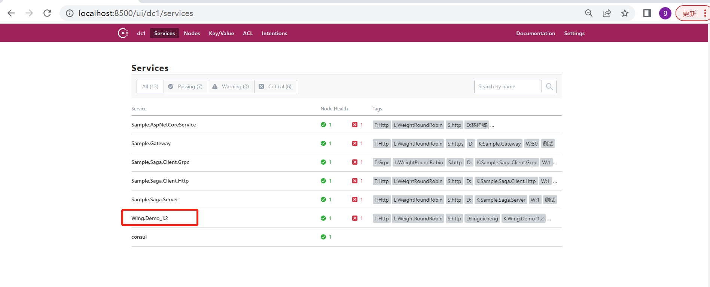

# 快速入门

## 介绍
`Wing`致力于打造一个功能强大、最接地气的`.NET`微服务框架，支持`.NET Core 3.1+`运行平台。支持`Consul`服务注册与发现，服务间通讯支持`http`和`grpc`调用，内置负载均衡器。支持`服务策略`配置，服务异常降级处理。支持
`Saga分布式事务`，支持三种恢复策略：向前恢复、向后恢复、先前再后。自带`配置中心`，服务配置可以在线集中统一管理。支持http/grpc/sql链路追踪`APM`及耗时分析统计。内置`服务网关`，支持全局服务策略和个性化服务策略配置。支持`RabbitMQ`事件总线，自带人性化的`Dashboard`管理界面。

### 文档地址
https://linguicheng.gitee.io/wing

### 依赖
需要用到的第三方中间件：`Consul`(强依赖)、`RabbitMQ`(弱依赖)、`数据库`(强依赖，目前支持SqlServer、Oracle、MySql、PostgreSql、Sqlite)

### 技术交流群
`QQ`:`183015352`

## 服务注册

### 什么是服务注册?

`服务注册`是指服务启动后将该服务的IP、端口等信息注册到`Consul`。

### 创建一个Web Api项目

* 提前准备：安装并启动Consul

* 打开 Visual Studio 2022 并创建Web Api项目([点击查看完整示例代码1.2](https://gitee.com/linguicheng/wing-demo/tree/master/1.2))

### 安装依赖包

```
dotnet add package Wing.Consul
```

### Program代码

```cs
using Wing;

var builder = WebApplication.CreateBuilder(args);

builder.Host.AddWing(builder => builder.AddConsul());

// Add services to the container.

builder.Services.AddControllers();

builder.Services.AddWing();

var app = builder.Build();

// Configure the HTTP request pipeline.

app.UseHttpsRedirection();

app.UseAuthorization();

app.MapControllers();

app.Run();
```

### 添加配置

```json
{
  // 是否启用配置中心，默认启用
  "ConfigCenterEnabled": false,
  "Consul": {
    "Url": "http://localhost:8500",
    "Service": {
      //Http  Grpc
      "Option": "Http",
      "HealthCheck": {
        "Url": "http://localhost:1210/health",
        //单位：秒
        "Timeout": 10,
        //单位：秒
        "Interval": 10
      },
      "Name": "Wing.Demo_1.2.1",
      "Host": "localhost",
      "Port": 1210,
      "Tag": "",
      "LoadBalancer": {
        //RoundRobin  WeightRoundRobin LeastConnection
        "Option": "WeightRoundRobin",
        //权重
        "Weight": 60
      },
      "Scheme": "http",
      "Developer": "linguicheng"
    },
    //定时同步数据时间间隔，单位：秒 小于等于0表示立即响应
    "Interval": 10,
    //数据中心
    "DataCenter": "dc1",
    //等待时间,单位：分钟
    "WaitTime": 3
  }
}
```

### 查看运行效果

* 程序运行后，打开consul UI管理界面，可以看到注册服务`Wing.Demo_1.2`，如下图：

